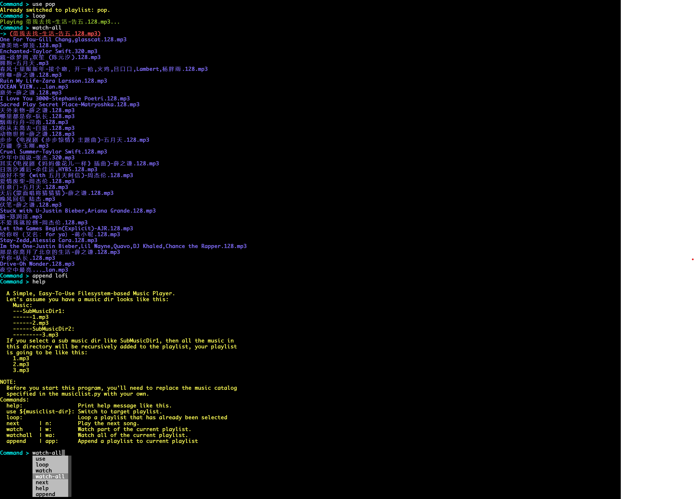

# TuneBox
A simple, easy-to-use filesystem-based music player written in python.

Currently supported features:
- playlist switching
- playlist appending
- log part or all of the playlist you are playing
- play the previous/next song
- forward/backward 10 seconds

## Installation
### Requirements
First you need a Python3 interpreter and ffplay, the version of interpreter that I am using is 3.12.6.

Then use `pip install -r requirements.txt` to install additional requirements.

After installation, type `python3 main.py` to launch this player.

## Configure
Currently a simple configuration file is provided as "~/.tuneboxrc.ini", you can modify the root music directory there. If the configuration file has not created yet,
it would prompt for the directory you want to play at startup of this program.

## Usage
This player is command based, instructions are executed every time you enter a command, If you want to check all the supported commands, just launch it and type "help".

This player is actually very simple. First, let's say you have specified a music root directory which looks like this:
```
-Music-Root:
    - 1.mp3
    - 2.mp3
    - Sub-Music-Dir1:
        - 3.mp3
        - Sub-Music-Dir2
            - 4.mp3
```
So the names and music files of all subdirectories under this directory will be recursively scanned, and corresponding completion functions will be provided accordingly.

If you then specify a music subsidiary directory, all music in that directory will be recursively added to the playlist.
```
So if you specify Sub-Music-Dir1 to be your playlist,
then your playlist is going to be like this:
  - 3.mp3
  - 4.mp3
```
Playlists can be specified before playing, or join with other playlists at runtime using corresponding command, if you want to know more, please launch and check the command list.

## Screenshots

